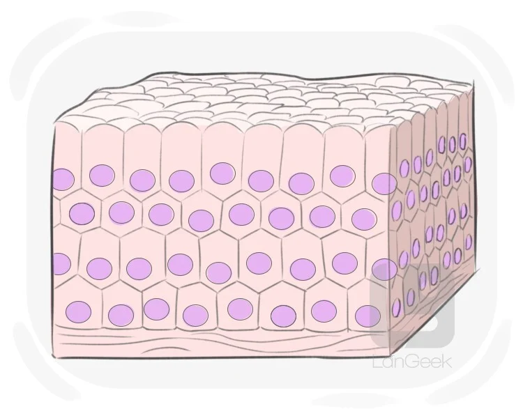

## Anatomy

1. ***资料***
- [Anatomy 3D Model](https://human.biodigital.com/explore)
- [Anatomy 3D Model 2](https://www.zygotebody.com/)

2. ***CrashCourse***
    - [The Nervous System](https://www.youtube.com/watch?v=qPix_X-9t7E&list=PL8dPuuaLjXtOAKed_MxxWBNaPno5h3Zs8&index=9)
        - Neurons (传递 signal )
    - [Tissue](https://www.youtube.com/watch?v=i5tR3csCWYo&list=PL8dPuuaLjXtOAKed_MxxWBNaPno5h3Zs8&index=3) = cells
        - Types: Epithelial, Connective, Nervous, Muscular
        - 分化成不同的cell, 处理不同的任务, 例如: 
            - Neuron
        

        
        

    - 

### Nervous System
1. ***资料***
    - [The Brain](https://www.youtube.com/watch?v=kMKc8nfPATI)
    - [3D Human Brain Anatomy](https://www.youtube.com/watch?v=Rcn46qujwkE)
    - [3D Model](https://www.brainfacts.org/3d-brain#intro=false&focus=Brain)
    - Human Nervous System
        - [Part 1](https://www.youtube.com/watch?v=_Dhj-RqfGe4&list=PLpw4kOpfNU9YLAGq8EmIXvyafi-LMwjYC&index=7)
        - [Part 2](https://www.youtube.com/watch?v=CurW-sIQPxU&list=PLpw4kOpfNU9YLAGq8EmIXvyafi-LMwjYC&index=8)

