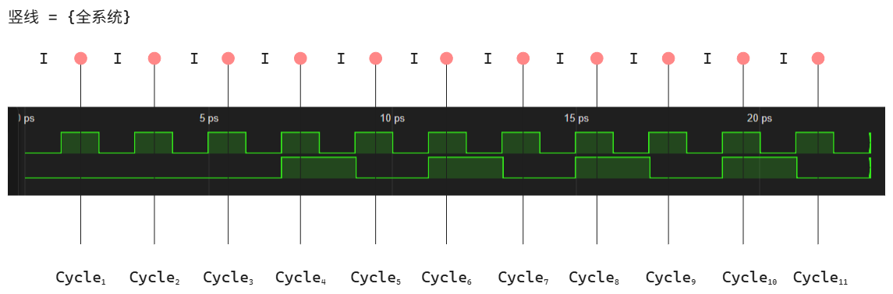

## Logic Simulation

1. **离散事件仿真 （Discrete Event Simulation）**
    - 仿真机制: 离散事件仿真
    - 仿真原理 
        - 依据: [离散输入驱动模型](IC-Model.md)
            $$I\ \text{changes} \;\Rightarrow\; 系统\ \text{changes}$$
        - 推论
            $$I \; changes \xRightarrow{\text{rule 1}}\; signal_1 \; changes\;\xRightarrow{\text{rule 2}}\; signal_2 \; changes \;\xRightarrow{\text{rule 3}}\; signal_3 \; changes \;\xRightarrow{\text{rule 4}}\; signal_4 \ \text{changes}$$
        - 结论
            - signal 改变 $\xRightarrow{\text{视为}}\;$ 事件发生   
            - 事件队列: $事件_1 \xRightarrow{\text{激活}}\; 事件_2 \xRightarrow{\text{激活}}\; 事件_3 \xRightarrow{\text{激活}}\; 事件_4$   
            - 等到所有事件队列全部收敛完成, 模拟结束   
            - 等待下一回合模拟
2. **分类**
    1. Event-based
        - 代表工具: ModelSim; VCS; iVerilog
        - 动态调度,求值顺序在仿真过程中(运行时刻)决定
        - 较慢，需要维护事件队列
        - 同步电路/异步电路/混合电路
        - 步进: timescale
        - 功能验证
        - 时序验证: 有逻辑时序, *但是没有真实的时序(无延迟信息)*

    2. Cycle-based
        - 代表工具: Verilator 
        - 静态调度,求值顺序在仿真开始前(编译时刻)决定
        - 较快, 编译时已经确定事件队列
        - 同步电路( 无时间戳, 不便于异步仿真 )
        - 步进: 周期
        - 功能验证

3. **重点解释**
    - 为什么Cycle-based不能模拟异步电路? Event-based能模拟异步电路?
        Event-based 横坐标是 time , 仿真时只需要指定 所有时间点 发生的 事件(I) 即可, 所有逻辑会在时间线上自动完成 
        Cycle-based 横坐标是 cycle , 仿真时: 
            $$
            I_{线网} \; changes \xRightarrow{\text{eval()}}\; 线网 \; changes
            $$
            $$
            I_{记忆} \; changes \;\xRightarrow{\text{eval()}}\; {记忆} \; changes
            $$
            适合同步电路(只需要功能验证, 不需要考虑时序)
        
        ==具体为什么不能模拟异步电路我也不完全太清楚, 但是基本上可以知道用于异步电路也不方便==

4. **Logic Simulation 的局限性**
    - 下次时钟上升沿前全部稳定(即默认时序全部收敛), 无法捕捉亚稳态(Metastability)
    - 只能验证逻辑正确性
    - <u>线延时</u>与<u>门延时</u>都被理想化为"零延迟"
    - 仿真的信号瞬间变化(延迟信息缺失), 真实的信号是像流水一样向后传播

    - **解决方案**
        - STA(静态时序分析)
        - LEC(逻辑等价性检查): 解决综合一致性问题
        - Post-Sim(后仿真): 带延迟信息的网表仿真, 捕捉时序相关的逻辑问题
        - 上板验证(流片或者fpga)

            $$
            赋值 \; I_{线网} \; \xRightarrow{\text{eval()}}\; 线网更新:波形,断言,打印(可选) \; \xRightarrow \; 赋值 \; I_{记忆} \; \xRightarrow{\text{eval()}}\; 记忆更新:波形,断言,打印(可选) \;
            $$

5. **验证流程**
    - 周期验证: 
    - 设置$\{I\}$ -> 更新$\{全系统\}$ -> 检查$\{O\}$ -> 检查$\{{记忆}\}$ ->检查$\{线网_{Internals}\}(可选)$
        
    - 预期对比: 
        - 预期波形, 观察实际波形
        - 预期断言, 观察实际断言(重点)
        - 预期打印, 观察实际打印
    - 参考[IC-Model-3.excalidraw](IC-Model-3.excalidraw)

6. **SoC Verification**
    - *如何验证设计好的SoC?* 
        - FPGA上板
        - ASIC流片
        - SoC(verilog)--Verilator--SoC(cpp) + cpp 外设: **类似NVBoard** 
            - 可用于验证大型SoC的逻辑功能
        - Python SoC: 
            - 可用于验证大型SoC的逻辑功能
