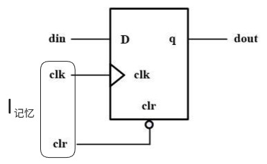

## Digital Circuit

1. 

2. **Digital Circuit**
    - ***模型方程 ( *Discrete System* )***
        - 定义
            $$
            \begin{cases}
            系统 &= \{\text{记忆}, \text{线网}\} \\
            线网 &= \{I, \text{Internals}, O\} \\
            I &= \{I_{\text{记忆}}, I_{\text{Internals}}\} \\
            I_{记忆} &= \{I_{clk}, I_{async}\}
            \end{cases}
            $$
            - {系统} : 瞬间的状态
            - {记忆} : 周期的状态
            - $I_{记忆}$
            

            
            

        - 特征
            $$
            \begin{cases}
            记忆_{next} &= next(系统) \\
            线网 &= F(系统) \\
            \end{cases}
            $$

        - 离散输入驱动模型 ( *Discrete Input Driver Model* )
            $$\{I\}\ \text{静止} \;\Rightarrow\; \{系统\}\ \text{静止}$$
        - **系统** 运动的条件
            - $\{I\}$ 改变

    - ***亚稳态来源***
        - 为什么会有亚稳态呢？
            - 基础: 
                - 亚稳态来源 **=** <u>异步输入</u> **=** $\{ x \in \{记忆_{signal}\} \mid x \neq I_{clk} \}$ **=** $\{ x \in \{线网\} \mid x \neq I_{clk} \}$
            - 解决方案:
                - 把 $\{ x \in \{记忆_{signal}\} \mid x \neq I_{clk} \}$ 全部转为 <u>同步输入</u>
    - ***何为同步输入 ?***
        - 本质上
            -  $\{ x \in \{记忆_{signal}\} \mid x \neq I_{clk} \}$ 都是 <u>异步输入</u>
            - **开放系统(详情看excalidraw)** 不存在 <u>同步输入</u>
        - 如何实现 <u>同步输入</u> ?
            - **封闭系统(详情看excalidraw)** 下 **收敛**
            - 使用 <u>记忆墙</u>

    - ***记忆***
        - 作用: 
            - 记忆
            - 记忆墙
                - 断流(阻止数据流向下流动)
                - 创造周期延迟
                - 异步转同步

    - ***设计流程***
        - $$设计_1 \xRightarrow{\text{验证}}\; 设计_2 \xRightarrow{\text{验证}}\; 设计_3 \xRightarrow{\text{验证}}\; 设计_4$$

