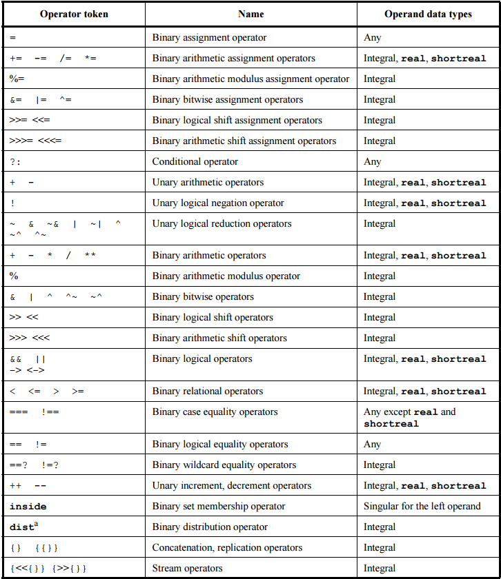
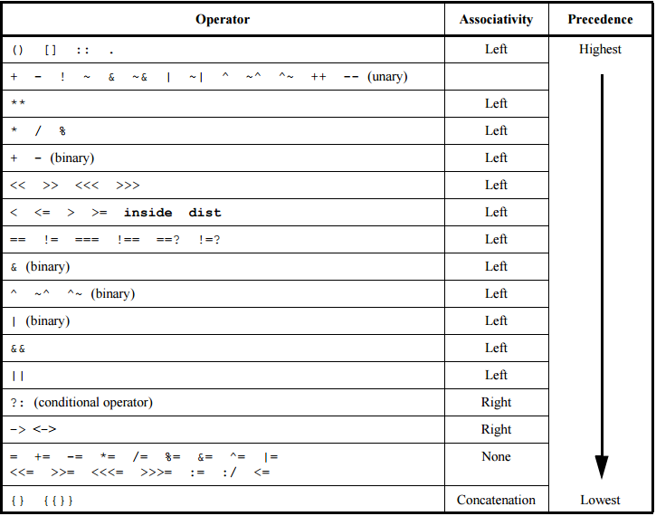

## SystemVerilog

1. 简介
    - SystemVerilog used to model, design, simulate, test and implement electronic systems

5. Lexical conventions
    - Number representation
        -  [sign][size]'[base][value]
        -  

6. Data types
    - Logic：0, 1，x, z
    - 

11. Operators and expressions
    - Operators 
        \
        