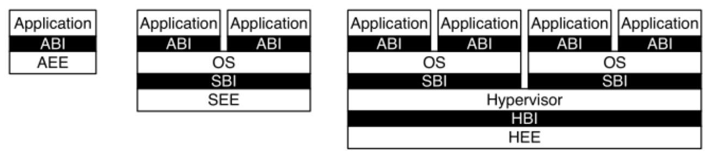
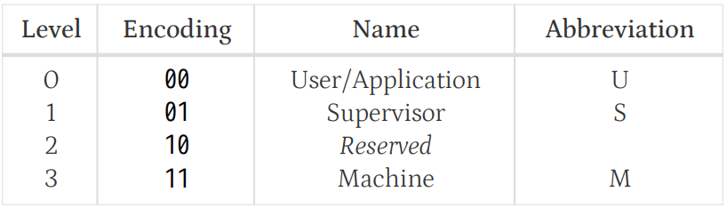
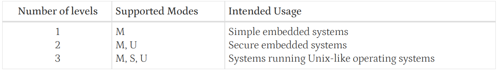

## Privileged ISA

### Introduction

1. Privileged Software Stack Terminology

2.  Privilege Levels

- 作用: 为不同的Software Stack之间提供保护

- 有3种实现,其中 M 模式必须实现
- Terminology: 
    - **vertical traps**: 发生 trap 时,CPU 从低特权级进入高特权级
    - **horizontal traps**: 发生 trap 时,CPU 从高特权级进入低特权级
3. Debug Mode(D-mode)
    - 用于调试的特权级
    - 主要用于:
        - off-chip debugging
        - manufacturing test

### Control and Status Registers (CSRs)
1. 
